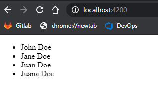

# How to enable CORS between an Angular app and an ASP.Net Web API Service
If you have an ASP Net WebAPI service running in one domain, and an angular app running in another domain, you'll need to enable CORS in the web service, in this example, we're also enabling Windows authentication
## Works for
* NET Framework 4.8
* Microsoft ASPNET Web API 
* Angular CLI 10.1
* Node 10.15
* Windows 10

1. Create a .NET WebAPI application with Windows Authentication
2. Create a folder and name it ***Models***
3. Inside ***Models*** create ***Employee.cs*** and this code:
   ```csharp
    public class Employee
    {
        public int Id { get; set; }
        public string Name { get; set; }
        public string Email { get; set; }
    }
   ```
5. Create the ***Employees*** controller, right click the ***Controllers*** folder and click ***Add Controller***
6. In the ***Add Scaffold*** window, select ***Web API 2 Controller - Empty***
7. In ***Controller Name*** write ***EmployeesController***
8.  In ***EmployeesController.cs*** include this code:
   ```csharp
    [RoutePrefix("api/Employees")]
    public class EmployeesController : ApiController
    {

        [HttpGet]
        [Route("GetEmployees")]
        public IHttpActionResult GetEmployees()
        {
            Employee[] employees = new Employee[4]
            {
                new Employee(){Id=1,Name="John Doe",Email="jdoe@email.com"},
                new Employee(){Id=1,Name="Jane Doe",Email="jadoe@email.com"},
                new Employee(){Id=1,Name="Juan Doe",Email="judoe@email.com"},
                new Employee(){Id=1,Name="Juana Doe",Email="juadoe@email.com"}
            };

            return Ok(employees);

        }
    }

   ```    
9. To check that the WebAPI service is working, open the app URL in the browser
    ```
    http://localhost:[PORT]/api/employees   
    ```
10. You should get the dummy data in XML
    ```xml
    <ArrayOfEmployee xmlns:i="http://www.w3.org/2001/XMLSchema-instance" xmlns="http://schemas.datacontract.org/2004/07/WebService.Models">
    <Employee>
        <Email>jdoe@email.com</Email>
        <Id>1</Id>
        <Name>John Doe</Name>
    </Employee>
    <Employee>
        <Email>jadoe@email.com</Email>
        <Id>1</Id>
        <Name>Jane Doe</Name>
    </Employee>
    <Employee>
        <Email>judoe@email.com</Email>
        <Id>1</Id>
        <Name>Juan Doe</Name>
    </Employee>
    <Employee>
        <Email>juadoe@email.com</Email>
        <Id>1</Id>
        <Name>Juana Doe</Name>
    </Employee>
    </ArrayOfEmployee>
    ```    
11. Install CORS support. In the Package Manager Console run:
    ```
    install-package microsoft.aspnet.webapi.cors
    ```
12. Modify ***WebApiConfig.cs*** like this:
    ```csharp
      public static class WebApiConfig
        {
            public static void Register(HttpConfiguration config)
            {
                // Web API routes
                config.MapHttpAttributeRoutes();

                config.Routes.MapHttpRoute(
                    name: "DefaultApi",
                    routeTemplate: "api/{controller}/{id}",
                    defaults: new { id = RouteParameter.Optional }
                );

                // Web API configuration and services
                EnableCorsAttribute cors = new EnableCorsAttribute("http://localhost:4200", "Accept, Origin, Content-Type, X-Auth-Token, cache-control, x-requested-with", "GET, POST ,PATCH, PUT, DELETE, OPTIONS");

                //In my case, this also works
                //EnableCorsAttribute cors = new EnableCorsAttribute( "*" ...
                

                cors.SupportsCredentials = true;
                config.EnableCors(cors);
            }
        }
    ```    
13. In a separate folder create the Angular-app    
    ```
    ng new angular-app
    ```
14. Import the HttpClient module into ***app.module.ts***
    ```typescript
    import { BrowserModule } from '@angular/platform-browser';
    import { NgModule } from '@angular/core';
    import { AppComponent } from './app.component';
    import {HttpClientModule} from '@angular/common/http'

    @NgModule({
    declarations: [
        AppComponent
    ],
    imports: [
        BrowserModule,
        HttpClientModule
    ],
    providers: [],
    bootstrap: [AppComponent]
    })
    export class AppModule { }
    ```
15. In ***src/app*** Create a folder and name it ***models***
16. Inside ***models*** create a file and name it ***employee.ts***    
17. In ***employee.ts*** write this code:
    ```typescript
    export interface Employee {
    Id: number;
    Name: string;
    Email: string;
    }
    ```
18. Replace all the content in ***app.component.html*** with:
    ```html
    <ul>
      <li *ngFor="let emp of Employees">{{emp.Name}}</li>
    </ul>
    ```    
19. Include this code in ***app.component.ts***
    ```typescript
    import { HttpClient } from '@angular/common/http';
    import { Component, OnInit } from '@angular/core';
    import { Employee } from './models/employee';

    @Component({
    selector: 'app-root',
    templateUrl: './app.component.html',
    styleUrls: ['./app.component.css']
    })
    export class AppComponent implements OnInit {
    title = 'angular-app';
    Employees: Employee[];
    constructor(private httpClient: HttpClient) {

    }
    ngOnInit(): void {
        this.httpClient.get<Employee[]>('http://localhost:54125/api/employees',
        { withCredentials:true }
        )
        .subscribe((employees: Employee[]) => {
            this.Employees = employees;
        });
    }
    }

    ```    
20. Replace the port number as necessary, run the app:
    ```
    ng serve
    ```    
21. You should see the list of employees on screen
    
    
## Resources
* https://stackoverflow.com/questions/48318464/angular-4-httpclient-cors-windows-auth?rq=1